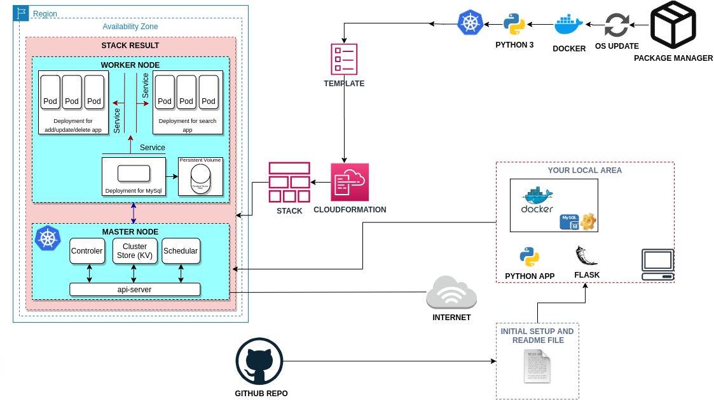

# Contact List Microservice Platform (Kubernetes)

Production-like microservice architecture deployed on Kubernetes to demonstrate containerized services, persistent storage, and secure configuration patterns (ConfigMaps + Secrets). The app is a simple phonebook system split into frontend (search) and backend (CRUD) services backed by MySQL.

## Key Highlights
- Kubernetes Deployments and Services (NodePort, ClusterIP)
- Persistent MySQL storage with PV/PVC
- ConfigMaps and Secrets for configuration separation and credential management
- Stateless services designed for horizontal scaling
- Deployable on AWS EC2-based Kubernetes clusters (master/worker)

## Architecture
- Frontend Service (read-only search) -> NodePort `30002`
- Backend Service (CRUD operations) -> NodePort `30001`
- MySQL Database (persistent) -> ClusterIP `3306`



## Services and API Endpoints

| HTTP Method | Action | Example |
| --- | --- | --- |
| `GET`  | Read records | `http://[ec2-hostname]:30001/` |
| `POST` | Create a record | `http://[ec2-hostname]:30001/add` |
| `POST` | Update a record | `http://[ec2-hostname]:30001/update` |
| `POST` | Delete a record | `http://[ec2-hostname]:30001/delete` |
| `POST` | Search records | `http://[ec2-hostname]:30002/` |

## What This Project Demonstrates
This repository focuses on the infrastructure and deployment side of a small microservice platform:

- Building separate Docker images for frontend and backend Flask services
- Running the system on Kubernetes with independent Deployments and Services
- Persisting MySQL data using PV/PVC
- Managing configuration with ConfigMaps and sensitive values with Secrets
- Exposing workloads externally with NodePort for a simple EC2-based Kubernetes setup

## Kubernetes Objects Overview

### Backend Deployment and Service (CRUD)
- Deployment runs one or more replicas
- Container port exposed on `80`
- DB connectivity configured via environment variables
- DB credentials stored in Kubernetes Secrets
- DB host and non-sensitive config stored in ConfigMaps
- Service type: `NodePort` on `30001`, targets port `80`

### Frontend Deployment and Service (Search)
- Deployment runs one or more replicas
- Container port exposed on `80`
- DB connectivity configured via environment variables
- DB credentials stored in Kubernetes Secrets
- DB host and non-sensitive config stored in ConfigMaps
- Service type: `NodePort` on `30002`, targets port `80`

### MySQL Deployment and Service (Persistent)
- Image: `mysql:5.7`
- Container port exposed on `3306`
- Persistent volume attached via PVC
- DB credentials stored in Kubernetes Secrets
- Service type: `ClusterIP`, exposes `3306`

### Persistent Volume and Claim
- Capacity: `20Gi`
- Access mode: `ReadWriteOnce`
- Host path: `/mnt/data`
- PVC defined to bind the volume

## Infrastructure Assumptions (EC2-based Kubernetes)
- 2 EC2 instances: 1 master, 1 worker
- Recommended minimum instance type: `t2.medium`
- Application accessible via browser from the public internet (via NodePort + Security Groups)
- Repository can be pulled and deployed using automation (for example, user data in a CloudFormation template)

## Project Structure

```text
Contact-List-Application
├── backend/
├── dev/
├── modules/
├── prod/
├── templates/
├── Microservice_structure.png
├── structure.jpeg
├── final_result.png
├── contact-list-app.py
└── README.md
